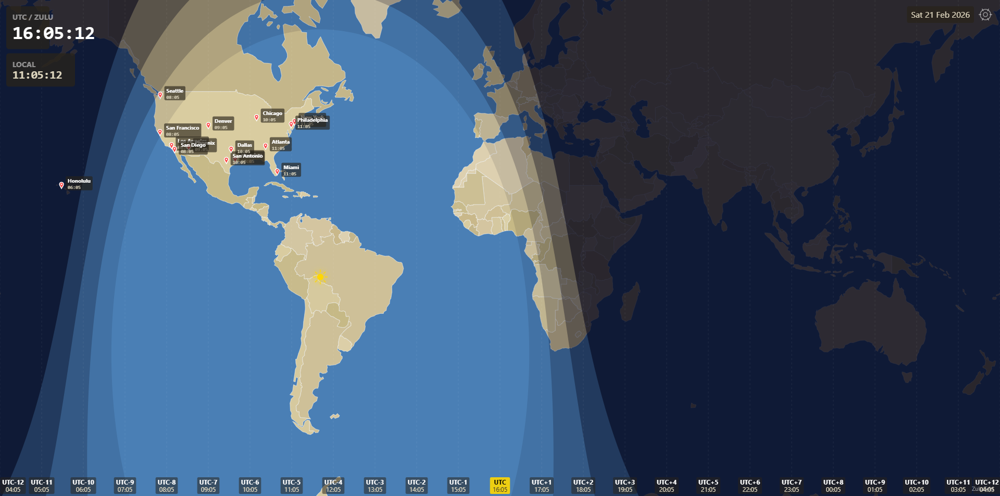
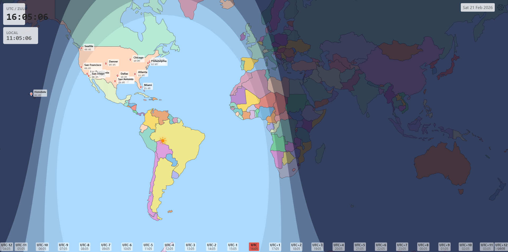
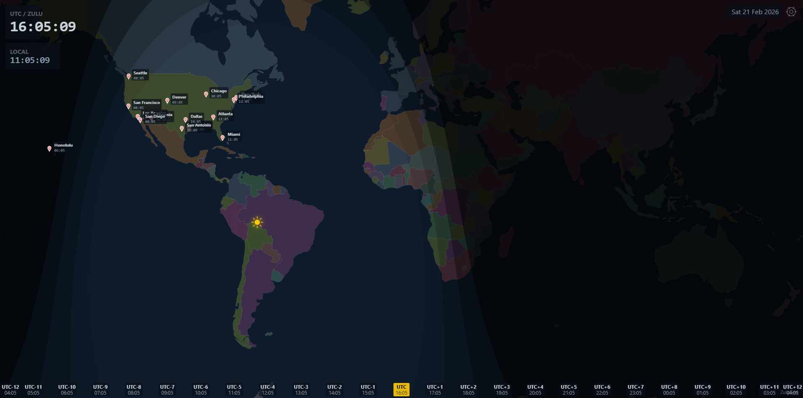
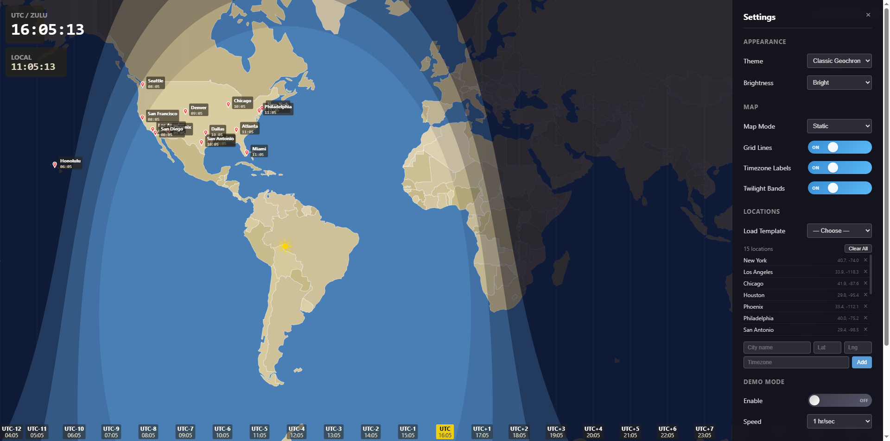

# ZuluGrid

A digital recreation of the classic [Geochron](https://www.geochron.com/) world clock, built for always-on displays in offices, operations centers, and conference rooms.

ZuluGrid renders a real-time geopolitical Mercator world map with day/night terminator, twilight bands, sun position tracking, 24 time zone clocks, and configurable location pins — all running client-side in the browser with no backend required.

**Built entirely by Claude** (Anthropic's AI assistant) — from architecture and astronomy math to canvas rendering and UI design.

### Classic Geochron Theme


### Modern Atlas Theme


### Dark Theme


### Settings Panel


## Inspired by the Geochron

The [Geochron World Clock](https://www.geochron.com/) has been a fixture in boardrooms and operations centers since 1967. Its mechanical map display shows where on Earth it's day or night, updated continuously by a precision clockwork mechanism.

ZuluGrid brings that same concept into the digital age — a free, open-source web app that replicates the Geochron's core functionality with modern astronomy calculations, multiple themes, and enterprise features like custom branding and location pins.

## Features

- **Mercator World Map** — Natural Earth political boundaries via d3-geo, rendered on HTML5 Canvas
- **Real-Time Day/Night Terminator** — Accurate solar position calculations with smooth terminator curve
- **Twilight Bands** — Civil, nautical, and astronomical twilight zones as graduated shading
- **Sub-Solar Point** — Sun marker showing the point on Earth directly beneath the sun
- **24 Time Zone Clocks** — All major UTC offsets displayed simultaneously along the bottom edge
- **Location Pins** — Pre-built templates (World Capitals, US Cities, European Capitals) plus custom pins with local time display
- **Three Color Themes**:
  - **Classic Geochron** — Warm earth tones, tan landmasses, blue ocean
  - **Modern Atlas** — Distinct country colors, bright and vibrant
  - **Dark** — Muted tones for 24/7 always-on displays
- **Demo / Time-Lapse Mode** — Watch a full day (or year) sweep across the map at configurable speed
- **Scrolling Map Mode** — Classic Geochron-style continuous map scroll matching Earth's rotation
- **Brightness Control** — Bright and dim modes for different lighting conditions
- **Custom Branding** — Upload a logo, set a title, toggle the ZuluGrid watermark
- **Keyboard Shortcuts** — `S` Settings, `B` Brightness, `D` Demo mode
- **Zero Dependencies on Backend** — Runs entirely in the browser, works offline after first load

## Quick Start

```bash
npm install
npm run dev
```

Open `http://localhost:5173` in any modern browser. On first launch, choose a pin template or skip to add your own.

## Build for Production

```bash
npm run build
```

Outputs to `dist/` — serve with any static file server, or open `dist/index.html` directly.

## Deploy on Raspberry Pi

Serve the `dist/` folder and open in Chromium kiosk mode:

```bash
chromium-browser --kiosk --noerrdialogs --disable-translate http://localhost:8080
```

## Architecture

Five stacked `<canvas>` layers, each redrawn independently:

| Layer | Content | Update Frequency |
|-------|---------|-----------------|
| Base Map | Country polygons, ocean fill | On theme change |
| Terminator | Day/night overlay, twilight bands, sun marker | Every 60s |
| Overlays | Time zone lines, labels | Every 1s |
| Pins | Location markers with local times | Every 1s |
| UI | UTC clock, local clock, date, branding | Every 1s |

### Astronomy

Solar calculations (declination, equation of time, sub-solar point) are implemented from first principles using VSOP-derived formulas, accurate to within 1 arcminute. The day/night terminator and twilight boundaries use `d3.geoCircle()` centered on the antipodal point.

## Tech Stack

| Tool | Purpose |
|------|---------|
| Vite | Dev server + bundler |
| TypeScript | All application code |
| d3-geo | Mercator projection + geo path rendering |
| topojson-client | TopoJSON to GeoJSON conversion |
| world-atlas | Natural Earth 1:110m country boundaries |
| mitt | Event bus (~200 bytes) |
| Vitest | Unit tests |

## Tests

```bash
npm test
```

16 unit tests covering solar declination, equation of time, sub-solar point calculation, and terminator geometry generation — validated against NOAA Solar Calculator reference values at equinoxes and solstices.

## License

MIT

## Credits

- Map data: [Natural Earth](https://www.naturalearthdata.com/) (public domain)
- Inspired by the [Geochron World Clock](https://www.geochron.com/) by Kilburg Manufacturing
- Built by [Claude](https://claude.ai) (Anthropic)
